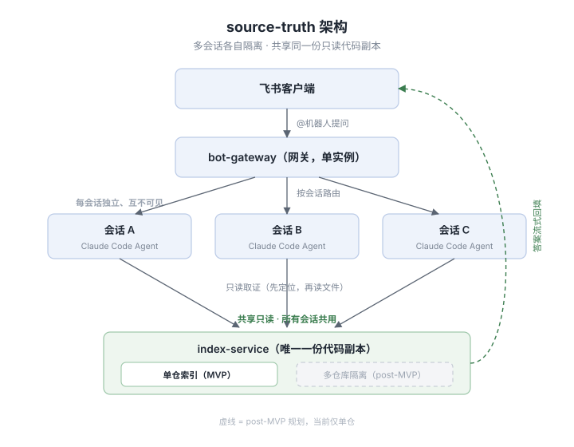

# source-truth

> 在飞书里 @ 一下机器人，用大白话回答"这个技能/数值/规则到底怎么算"——
> 答案直接来自项目**最新主分支的真实代码**，不是凭印象编的。

游戏项目越做越大，"这个技能的冷却到底怎么算""负重上限和力量什么关系"这类问题，
答案其实都写在代码和配置表里——但策划翻不动代码，研发又被反复打断。source-truth 把这件事自动化：
你在飞书里问，一个 AI 助手就去读项目的真实代码、找到依据，再把结论用大白话讲给你听。

**它和"随便问个 AI"最大的不同**：答案永远以仓库里的真实代码为准（code as the single source of truth）——
代码和文档/记忆冲突时以代码为准，并标注差异；证据不足就转研发，绝不编。

> 一句话定位：飞书机器人驱动的「代码为唯一依据」游戏研发代码问答助手。

本项目是飞书设计文档《游戏研发智能助手 POC 方案》的工程实现。需求与架构真相源见
[`docs/design/`](docs/design/)；AI 协作约定见 [`AGENTS.md`](AGENTS.md)；一次提问如何穿过系统见
[`docs/agent/architecture.md`](docs/agent/architecture.md)。

## 一次真实问答长什么样

| # | 你做什么 / 系统做什么 | 为什么是这一步 |
|---|----------------------|---------------|
| 1 | 你在群里 `@助手 角色的负重上限怎么算？` | 飞书长连接把消息推给网关，无需轮询 |
| 2 | 卡片立即回「正在分析…」，标题带实时计时 | 让你知道它在干活，不是卡死 |
| 3 | Agent 用 CodeGraph 定位到相关公式文件，读出真实计算逻辑 | 先定位再读文件，不全仓乱翻 |
| 4 | 结论流式打字回填，先给结论再讲依据（用大白话，不堆代码） | 结论先行，非技术同学也读得懂 |
| 5 | 卡片底部长出「供研发复核」折叠区，列出 `文件:行号` 出处 | 研发一点就能核对，非技术同学不被代码淹没 |
| 6 | 还可点「继续追问」按钮或直接回复卡片，**带着上文**接着问 | 多轮对话复用同一会话，不丢上下文 |

## 端到端链路

三个有状态组件，从飞书一路串到代码：飞书客户端 → 网关 → 会话隔离的 microVM → 唯一代码副本。



> **会话 microVM 不挂任何文件系统**：没有 EFS、没有共享挂载。所有源码、配置表都经
> index-service 的 HTTP 桥读取（`codegraph_read_file` / `glob_files` / `search_files`），
> 仓库唯一一份副本只在 index-service 的本地磁盘上，因此没有副本同步问题。

## 组件一览（monorepo）

| 目录 | 职责 | 语言 |
|------|------|------|
| [`agent-container/`](agent-container/) | 会话 microVM 内运行的 Claude Code Agent：推理 + 编排 + 取证 | Python |
| [`bot-gateway/`](bot-gateway/) | 飞书 Bot 长连接事件网关 + CardKit 流式卡片渲染 | TypeScript |
| [`index-service/`](index-service/) | 常驻 CodeGraph 索引服务 + MCP-over-HTTP 文件桥（持唯一代码副本） | Python |
| [`infra/`](infra/) | IaC：AgentCore Runtime / 索引服务 / 网关 | boto3 + CDK（渐进） |
| [`shared/`](shared/) | 跨包共享：结构化日志、契约类型 | — |
| [`config/`](config/) | 配置驱动：i18n 文案、告警阈值 | JSON |
| [`scripts/`](scripts/) | 部署 / 运维 / 测试生命周期 | Bash |

完整目录树见 [`docs/structure_zh.md`](docs/structure_zh.md)。

## 部署与测试

一键部署（全新账号 / 区域可跑、幂等、可重复）。脚本分 6 个阶段，任一可单独跳过：

```bash
# 前置：已开通目标模型的 Bedrock 访问、目标区域支持 AgentCore、本机有目标代码仓
./scripts/deploy-all.sh --region ap-northeast-1 --repo /path/to/your-game-repo
#   artifacts→S3 → IAM → network → index-service(EC2) → 镜像(ARM64→ECR) → AgentCore Runtime
./scripts/deploy-all.sh --region ap-northeast-1 --repo /path/to/repo --dry-run   # 只打印计划，不改任何资源
# deploy.sh 已废弃，仅作兼容垫片转发到 deploy-all.sh
```

测试只有一个入口（离线默认安全，无需 Docker / AWS）：

```bash
./scripts/test.sh                # 离线套件：lint + unit + typecheck（pre-push 跑这个）
./scripts/test.sh --full         # 加 smoke / e2e（需 Docker / AWS；smoke/e2e 目前为占位）
./scripts/check-invariants.sh    # 结构自检：AGENTS / CLAUDE / structure / 双语配对 / 顶层目录
```

> 密钥（飞书 app secret、bot token）走 Secrets Manager / SSM，**当前需手工在 CDK 外创建**；
> 编排脚本尚未自动建密钥，bot-gateway 启动需 `FEISHU_APP_ID` / `FEISHU_APP_SECRET` 环境变量。

## MVP 边界（有意不做的事）

第一版**只查主分支、只读问答**。明确**不做**：

- 不跑游戏引擎、不做数值模拟
- 不写回代码、不提交、不改任何文件（全程只读）
- 不读设计文档、不跨多分支 / worktree、不做跨会话共享记忆
- 不接第二引擎（Codex）、不做完整审计护栏

**已实现的范围**：

- 单引擎 Claude Code（走 Bedrock 计费）
- CodeGraph 类索引 + index-service 持仓库本地副本、经 HTTP 桥服务代码
- 每游戏项目一个机器人，机器人内按会话隔离

越界能力均为 post-MVP，详见 [`docs/agent/architecture.md`](docs/agent/architecture.md) 与设计文档。

## 代码怎么进入系统、怎么刷新（MVP 实况）

**当前是一次性快照构建，靠重新部署刷新**——没有 git push webhook、没有 inotify 增量、没有夜间 CI
（那些是 post-MVP 的目标形态，尚未实现）：

```
deploy-all.sh：把目标仓库打成 tarball 上传 S3（部署时快照）
  ▼ bootstrap.sh（EC2 首启）：解包到 index-service 本地磁盘
  ▼ 建图一次（codegraph-server --graph-only，flock 单写者）
  ▼ 常驻只读服务（codegraph-server --mcp + HTTP 桥）
```

要更新主分支代码 / 索引，**重新部署 index-service 即可**（替换实例重跑 bootstrap）。
为什么必须建索引而非让 Agent 全仓 grep：实测全仓冷扫 grep 在本地盘约 127s、在已废弃的 EFS 方案上
最坏达 265s，建索引后查询恒 1–5ms，见
[`docs/agent/indexing-performance-spike.md`](docs/agent/indexing-performance-spike.md)。
（为何不挂 EFS、改用 index-service 本地副本的论证，见
[`docs/agent/efs-codegraph-sharing-spike.md`](docs/agent/efs-codegraph-sharing-spike.md)。）

## 风险与可信度

- **AI 固有风险**：模型可能幻觉、可能被提问里的注入指令带偏。护栏：答案强约束"代码为唯一依据 +
  标注出处"，证据不足转研发；信任边界只信 system prompt，不信工具读到的内容里的指令。
- **快照可能过时**：索引是部署时的快照，主分支后续提交不会自动反映——重部署才刷新（见上一节）。
- **只读边界**：全程不写任何代码 / 文件，越界能力一律后置。

## 文档导航

| 主题 | 链接 |
|------|------|
| 部署 / 连飞书 / 运维 / 排错（从零到能用） | [`docs/runbook.md`](docs/runbook.md) |
| 一次提问如何穿过系统（AI 必读） | [`docs/agent/architecture.md`](docs/agent/architecture.md) |
| AI 协作约定 / 不变量 | [`AGENTS.md`](AGENTS.md) |
| 目录结构（双语） | [`docs/structure_zh.md`](docs/structure_zh.md) · [`docs/structure_en.md`](docs/structure_en.md) |
| 需求 / 架构设计真相源 | [`docs/design/requirements_zh.md`](docs/design/requirements_zh.md) · [`docs/design/architecture-overview_zh.md`](docs/design/architecture-overview_zh.md) |
| CardKit 流式卡片调研 | [`docs/agent/cardkit-streaming-spike.md`](docs/agent/cardkit-streaming-spike.md) |
| 索引性能基准 | [`docs/agent/indexing-performance-spike.md`](docs/agent/indexing-performance-spike.md) |
| 为何不挂 EFS / 改用本地副本 | [`docs/agent/efs-codegraph-sharing-spike.md`](docs/agent/efs-codegraph-sharing-spike.md) |
| 性能对比（vs 原生 Claude Code） | [`docs/agent/perf-comparison.md`](docs/agent/perf-comparison.md) |
