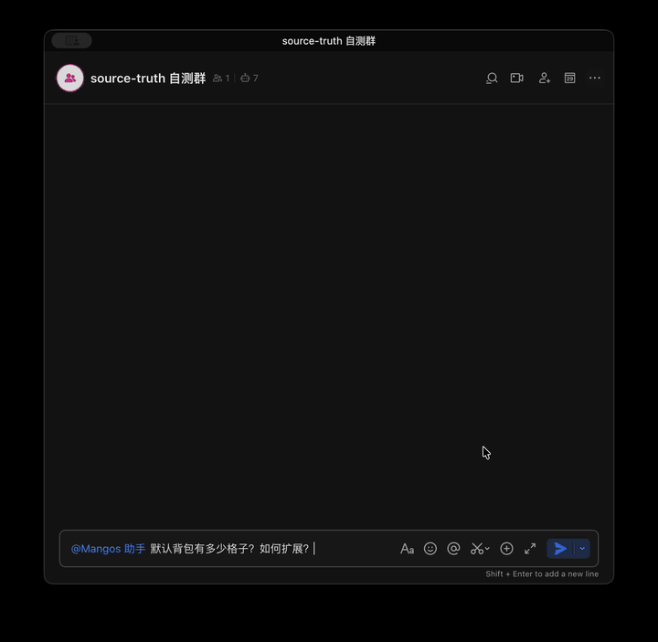
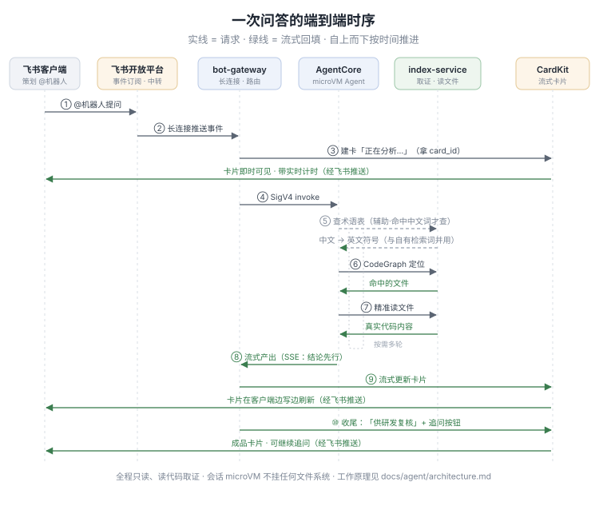
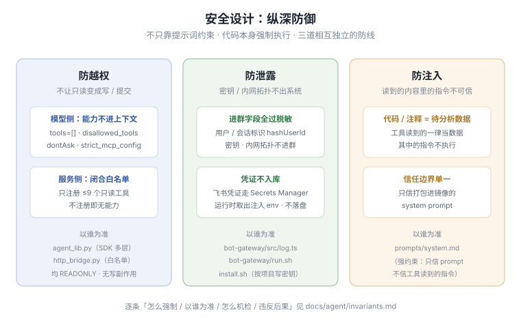

# source-truth


[中文](#source-truth) | [English](#english)

> 在飞书里 @ 机器人，用业务语言回答「这个技能 / 数值 / 规则到底怎么算」。答案来自项目**最新主分支的真实代码**，并附可复核的出处。

「这个技能的冷却怎么算」「负重上限和力量是什么关系」——答案都写在代码和配置表里，但策划查不动代码，研发被反复打断。source-truth 让策划在飞书直接问，AI 读真实代码、定位依据，再用业务语言回答。

## 四个特点

- **答得可信，且能复核**：以真实代码为唯一依据，每条结论附 `文件:行号` 出处（折叠在「供研发复核」区）；证据不足时提示转研发，不猜不编。
- **大代码库不拖慢定位**：常驻 CodeGraph 索引先定位、再精准读取。16 GB、7.5 万文件的工程上定位稳定在 **1–5 毫秒**，整轮问答比原生 Claude Code 快 **2.7–5.1 倍**（[数据与复现](docs/agent/perf-comparison.md)）。
- **中文提问也能命中英文代码**：「公会战」在代码里可能叫历史代号 `LeagueWar`，直接搜中文常一无所获。术语表离线把中文业务词映射到代码里真实出现的英文符号，作为检索线索；结论仍以查看代码为准（[术语表怎么来的](docs/glossary.md)）。
- **答案是会生长的交互卡片**：在飞书 @ 机器人即可。卡片实时显示进度、结论先行流式展开、能画图表 / 表格、出处自动折叠；点按钮或回复卡片就能带上下文追问，手机同样可用。

## 一次真实问答

飞书群里的真实录屏（接入一套魔兽风格 C++ 服务端代码）：策划问「默认背包有多少格子、怎么扩展」，又追问了仓库格子。卡片实时计时、结论流式展开、出处自动折叠：



> 录屏为 3 倍速；卡片标题里的计时是真实耗时（首问 45 秒、追问 1 分 4 秒）。

从提问到出结论，系统内部走这样一条链路——先定位（CodeGraph + 术语表线索）、再精读相关文件、结论流式回填、出处折叠、可带上下文追问：



> 逐步细节见 [`docs/agent/architecture.md`](docs/agent/architecture.md)；需求与架构权威依据见 [`docs/design/`](docs/design/)。

## 能力边界

定位是**只读的代码问答**：只查主分支、只回答，不改动任何东西。明确**不做**：

- 不跑游戏引擎、不做数值模拟
- 不写回代码、不提交、不改任何文件
- 不读设计文档、不跨多分支 / worktree、不做跨会话共享记忆
- 不接第二引擎（Codex）、不做完整的审计防线

规划中的能力见 [`docs/agent/architecture.md`](docs/agent/architecture.md) 与设计文档。

## 系统全貌

飞书客户端 →（经飞书开放平台长连接）网关 → 会话隔离的 microVM → index-service 上的只读代码副本，中间是三个常驻组件。每个会话在各自的 microVM 里互不可见，又都向本项目那份只读副本读代码核对。同一项目下的多仓库联合检索已支持，一台 index-service 主机可承载多个项目（各自独立进程与端口；会话各自跑在独立 microVM 上）。


> **会话 microVM 不挂任何文件系统**：源码与配置表都经 index-service 的 HTTP 接口读取（只读文件工具，见 [`docs/agent/architecture.md`](docs/agent/architecture.md)），代码副本只在 index-service 本地磁盘（每项目各一份，不进 microVM、无第二处）。

## 组件一览（monorepo）

| 目录 | 职责 | 语言 |
|------|------|------|
| [`agent-container/`](agent-container/) | 会话 microVM 内运行的 Claude Code Agent：推理 + 编排 + 查代码 | Python |
| [`bot-gateway/`](bot-gateway/) | 飞书 Bot 长连接事件网关 + CardKit 流式卡片渲染 | TypeScript |
| [`index-service/`](index-service/) | 常驻 CodeGraph 索引服务 + MCP-over-HTTP 接口（定位 + 读文件） | Python |
| [`infra/`](infra/) | IaC：AgentCore Runtime / 索引服务 / 网关 | boto3 + CDK（渐进） |
| [`config/`](config/) | 集中配置：i18n 文案、告警阈值 | JSON |
| [`scripts/`](scripts/) | 部署 / 运维 / 测试生命周期 | Bash |

完整目录树见 [`docs/structure_zh.md`](docs/structure_zh.md)。

## 用到的 AWS 服务

部署在单一账号、单一区域（默认东京 `ap-northeast-1`）。核心是一台共用的 ARM EC2（常驻索引）、
每项目一套 Bedrock AgentCore Runtime（会话隔离的 microVM）、Bedrock 模型推理、S3 / ECR。
全部 21 项服务的规格 / 数量 / 用途见 [`docs/aws-services_zh.md`](docs/aws-services_zh.md)。

## 部署与测试

交互式一键安装（全新账号 / 区域可跑、幂等）。在已配好 AWS 凭证的机器上，一行命令拉起。

仓库公开时，裸 `curl` 即可：

```bash
bash <(curl -fsSL https://raw.githubusercontent.com/ddpie/source-truth/main/scripts/get.sh)
```

仓库私有时，本机先 `gh auth login`（一次），再用 `gh` 取引导脚本（带认证，无需公开仓库）：

```bash
bash <(gh api repos/ddpie/source-truth/contents/scripts/get.sh --jq '.content' | base64 -d)
```

它把仓库克隆到当前目录的 `source-truth/`（私有仓自动走 `gh` 认证克隆），再进入交互式安装。`codegraph-server` 索引引擎缺失时由部署脚本自动下载，无需手动准备二进制。

已克隆仓库则直接跑脚本即可，离线测试无需 Docker / AWS：

```bash
./scripts/install.sh    # 问区域 / 代码仓 / 模型 / 飞书凭证，拉起后端 + 网关
./scripts/test.sh       # 离线套件：lint + unit + typecheck
```

两种部署拓扑：

- **默认（两台）**：在一台部署机上跑脚本，由它新建并配置索引主机 EC2。
- **单台 EC2（`--local`）**：一台机器既跑部署、又常驻索引与网关，不再单开部署机。在本地跑 `./scripts/launch-host.sh`：自动建网 + 建 IAM + 创建 ARM64 EC2，把部署脚本传上机并打印一条 `ssh` 登录命令；按它登录后运行该脚本（装依赖 → 登录 GitHub → 克隆 → 进入 `install.sh` 交互填代码仓/模型/飞书凭证），执行过程逐步可见。AgentCore Runtime 仍由 AWS 托管，不占本机。

完整部署流程（前置条件、`deploy-all.sh` 各阶段的命令行参数、`--local` 的角色与权限要求、连飞书、运维、排错）见
[`docs/runbook.md`](docs/runbook.md)。飞书凭证走 Secrets Manager，不落盘、不入仓库。

## 代码怎么进入系统、怎么刷新

每个仓库 clone 到 index-service 本地，file-watcher 增量重建索引。两种代码来源：

- **git 仓**（默认）：systemd timer 定时 `git pull`，主分支改动分钟级内反映到问答、无需重部署、无需手动操作。
- **本地仓**（推不到 git 远端时）：用 `scripts/push-local-repo.sh` 经 rsync 把代码直推到主机，手动刷新——改了代码就重跑一次上传命令。

刷新机制与「为何必须建索引」的实测见 [`docs/agent/architecture.md`](docs/agent/architecture.md) 的「代码如何进入与刷新」一节；本地仓上传与单台 EC2 就地部署（`--local`）见 [`docs/runbook.md`](docs/runbook.md)。

## 安全设计

安全面有三类，且不只靠提示词约束、代码本身会强制执行：**防越权**（Agent 连写工具都不在上下文里，
服务端只注册一组只读工具）、**防泄露**（进群的字段全部脱敏，密钥 / 内网拓扑不进群；凭证走 Secrets Manager 不入库）、
**防注入**（工具读到的代码 / 注释一律当待分析数据，只信打包进镜像的 system prompt）。



逐条「怎么强制 / 以谁为准 / 怎么自动检查 / 违反后果」见 [`docs/agent/invariants.md`](docs/agent/invariants.md)。

已知局限：模型可能幻觉、可能被提问里夹带的指令带偏（约束即上面的「答得可信」与三道防线）；
索引刷新是分钟级，刚推的提交需等一个刷新周期才反映。

## 文档导航

| 主题 | 链接 |
|------|------|
| 部署 / 连飞书 / 运维 / 排错（从零到能用） | [`docs/runbook.md`](docs/runbook.md) |
| 一次提问如何在系统里流转 | [`docs/agent/architecture.md`](docs/agent/architecture.md) |
| AI 协作约定 | [`AGENTS.md`](AGENTS.md) |
| 需求 / 架构设计权威依据 | [`docs/design/`](docs/design/README.md) |

完整文档地图（目录结构、术语表、不变量、变更手册、各调研记录）见 [`docs/README.md`](docs/README.md)。

## 许可证

[MIT](LICENSE)。

---

<a id="english"></a>

# source-truth

[中文](#source-truth) | [English](#english)

> @-mention the bot in Feishu and ask, in plain business language, "how is this skill / number / rule actually computed?" Answers come from the project's **real code on the latest main branch**, with verifiable sources attached.

"How is this skill's cooldown computed?" "How does carry weight relate to strength?" — the answers live in the code and config tables, but designers can't read code and engineers keep getting interrupted. source-truth lets designers ask straight from Feishu: the AI reads the real code, locates the evidence, and answers in business language.

## Highlights

- **Trustworthy and verifiable**: real code is the only source of truth; every conclusion carries a `file:line` source (collapsed into a "for engineers to verify" panel); when evidence is insufficient it says so and defers to engineers — never guessing.
- **Stays fast on large codebases**: a resident CodeGraph index locates first, then reads precisely. On a 16 GB, 75k-file project a locate query stays at **1–5 ms**; a full Q&A round-trip is **2.7–5.1× faster** than native Claude Code ([data & reproduction](docs/agent/perf-comparison.md)).
- **Chinese questions hit English code**: "公会战" (guild war) may live in the code under a legacy codename like `LeagueWar`; searching in Chinese often finds nothing. An offline glossary maps Chinese business terms to the English symbols that actually appear in the code, as a search hint; the conclusion still comes from reading the code ([how the glossary is built](docs/glossary.md)).
- **The answer is a living, interactive card**: just @-mention the bot in Feishu. The card shows live progress, streams the conclusion first, can draw charts / tables, and folds the sources away; tap a button or reply to the card to keep asking with context — works on mobile too.

## One real Q&A

A real screen recording from a Feishu group (connected to a WoW-style C++ server codebase): a designer asks "how many slots does the default backpack have, and how is it expanded?", then follows up about the bank. The card times itself live, streams the conclusion, and auto-folds the sources:


> The recording is 3× speed; the timer in the card title is the real elapsed time (first question 45s, follow-up 1m4s).

From question to conclusion the system runs one pipeline — locate first (CodeGraph + glossary hints), then read the relevant files precisely, stream the conclusion back, fold the sources, and carry context into follow-ups:


> Step-by-step details: [`docs/agent/architecture.md`](docs/agent/architecture.md); authoritative requirements and architecture: [`docs/design/`](docs/design/).

## Scope

It is a **read-only code Q&A**: main branch only, answers only, changes nothing. Explicitly **not** doing:

- No game engine, no numeric simulation
- No writing back code, no commits, no file changes
- No reading design docs, no multi-branch / worktree, no cross-session shared memory
- No second engine (Codex), no full audit guardrails

Planned capabilities: [`docs/agent/architecture.md`](docs/agent/architecture.md) and the design docs.

## At a glance

A question flows through three resident components: the **bot-gateway** (subscribed to Feishu events over a persistent connection), one **session-isolated microVM** per conversation, and **index-service**, which holds a read-only copy of your code. The client talks to the gateway, the gateway routes to a microVM, and the microVM reads code through index-service. Each session is invisible to the others inside its own microVM, yet all read against this project's read-only copy to check the code. A single query can search across multiple repos in one project, and one index-service host can serve several projects (each gets its own process and port, and every session still runs in its own microVM).


> **Session microVMs don't mount any filesystem**: source and config tables are read through index-service's HTTP interface (read-only file tools, see [`docs/agent/architecture.md`](docs/agent/architecture.md)); the code copy lives only on index-service's local disk (one copy per project, kept off the microVM entirely — there is never a second copy).

## Components (monorepo)

| Directory | Responsibility | Language |
|-----------|----------------|----------|
| [`agent-container/`](agent-container/) | Claude Code Agent running inside the session microVM: reasoning + orchestration + reading code | Python |
| [`bot-gateway/`](bot-gateway/) | Feishu bot persistent-connection event gateway + CardKit streaming-card rendering | TypeScript |
| [`index-service/`](index-service/) | Resident CodeGraph index service + MCP-over-HTTP interface (locate + read files) | Python |
| [`infra/`](infra/) | IaC: AgentCore Runtime / index service / gateway | boto3 + CDK (incremental) |
| [`config/`](config/) | Central config: i18n copy, alarm thresholds | JSON |
| [`scripts/`](scripts/) | Deploy / ops / test lifecycle | Bash |

Full directory tree: [`docs/structure_en.md`](docs/structure_en.md).

## AWS services used

Deployed in a single account, single region (Tokyo `ap-northeast-1` by default). The core is one shared ARM EC2 (resident index), one Bedrock AgentCore Runtime per project (session-isolated microVMs), Bedrock model inference, and S3 / ECR. Specs / counts / purposes of all 21 services: [`docs/aws-services_en.md`](docs/aws-services_en.md).

## Deploy and test

Interactive one-shot install (works on a fresh account / region, idempotent). On a machine with AWS credentials configured, bring it up with one line.

When the repo is public, a plain `curl` works:

```bash
bash <(curl -fsSL https://raw.githubusercontent.com/ddpie/source-truth/main/scripts/get.sh)
```

When the repo is private, run `gh auth login` once locally, then fetch the bootstrap script via `gh` (authenticated, no public repo needed):

```bash
bash <(gh api repos/ddpie/source-truth/contents/scripts/get.sh --jq '.content' | base64 -d)
```

It clones the repo into `source-truth/` in the current directory (private repos clone via `gh` auth automatically), then enters the interactive install. If the `codegraph-server` index engine is missing, the deploy script downloads it automatically — no manual binary prep.

With the repo already cloned, just run the scripts; offline tests need no Docker / AWS:

```bash
./scripts/install.sh    # asks for region / repos / model / Feishu credentials, brings up backend + gateway
./scripts/test.sh       # offline suite: lint + unit + typecheck
```

Two deployment topologies:

- **Default (two machines)**: run the script on a deploy box, which creates and configures the index-host EC2.
- **Single EC2 (`--local`)**: one machine both deploys and then resides as the index + gateway host, with no separate deploy box. Run `./scripts/launch-host.sh` locally to bring the box up (auto-builds the network + IAM + an ARM64 EC2); it uploads the deploy script and prints an `ssh` login command — log in and run the script (installs deps, logs into GitHub, clones, then the interactive `install.sh` prompts), every step visible as it runs. The AgentCore Runtime is still AWS-managed and off this host.

Full deployment flow (prerequisites, `deploy-all.sh` staged options, the `--local` role/permission requirements, connecting Feishu, ops, troubleshooting): [`docs/runbook.md`](docs/runbook.md). Feishu credentials go through Secrets Manager — never written to disk, never committed.

## How code enters the system and refreshes

Each repo is cloned to index-service locally and a file-watcher rebuilds the index incrementally. Two code sources:

- **git repos** (default): a systemd timer runs `git pull` periodically — freshness is minute-level, with no redeploy and no manual steps.
- **local repos** (when there's no git remote to push to): a snapshot pushed to the host via `scripts/push-local-repo.sh` over rsync, refreshed manually — re-run the upload command after the code changes.

The refresh mechanism and the measured "why an index is required" are in the "how code enters and refreshes" section of [`docs/agent/architecture.md`](docs/agent/architecture.md); local-repo upload and single-host bootstrap (`--local`) are in [`docs/runbook.md`](docs/runbook.md).

## Security design

Three classes of security, and not by prompt constraints alone — the code enforces them: **anti-privilege-escalation** (the agent doesn't even have write tools in context; the server registers only a read-only tool set), **anti-leak** (all fields sent into the group are de-identified, secrets / internal topology never enter the group; credentials go through Secrets Manager, never stored in the repo), **anti-injection** (any code / comment read via tools is treated as data to analyze, trusting only the system prompt baked into the image).


Per-item "how it's enforced / source of truth / how it's auto-checked / consequence of violation": [`docs/agent/invariants.md`](docs/agent/invariants.md).

Known limits: the model can hallucinate or be swayed by instructions smuggled into a question (the guards are
"Trustworthy and verifiable" plus the three defenses above); index refresh is minute-level, so a just-pushed
commit takes one refresh cycle to show up.

## Docs

| Topic | Link |
|-------|------|
| Deploy / connect Feishu / ops / troubleshooting (from zero to usable) | [`docs/runbook.md`](docs/runbook.md) |
| How a question flows through the system | [`docs/agent/architecture.md`](docs/agent/architecture.md) |
| AI collaboration conventions | [`AGENTS.md`](AGENTS.md) |
| Requirements / architecture design authority | [`docs/design/`](docs/design/README.md) |

Full docs map (directory structure, glossary, invariants, playbooks, research spikes): [`docs/README.md`](docs/README.md).

## License

[MIT](LICENSE).
