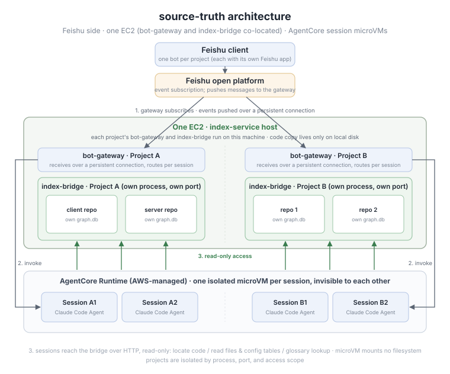
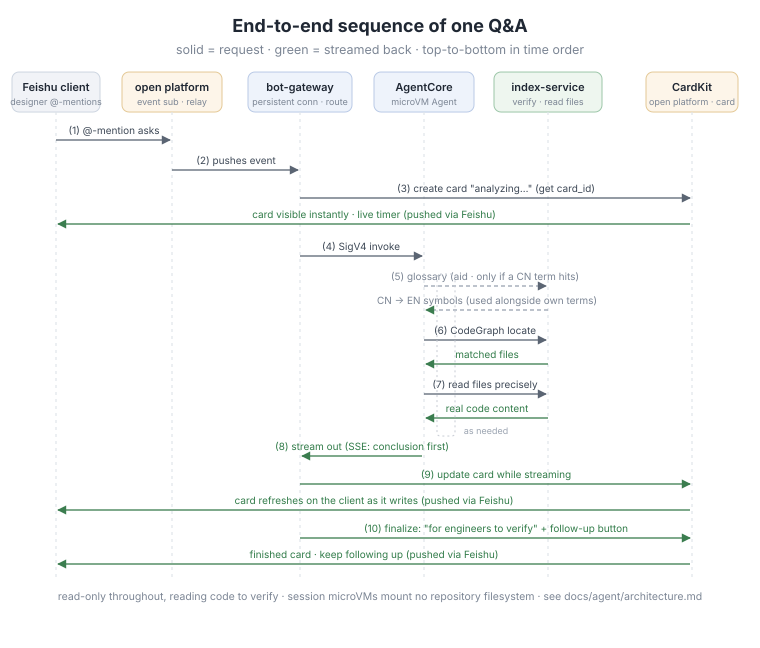
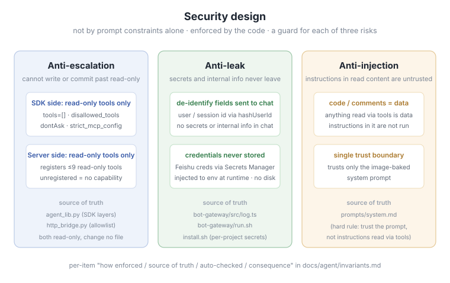

# sample-code-qa-on-agentcore


> This is a sample project demonstrating how to build a production-grade code Q&A agent on [AWS Bedrock AgentCore](https://aws.amazon.com/bedrock/agentcore/). It shows how to connect a chat platform (Feishu/Lark) to an AI agent that answers questions about your codebase using real source code as the single source of truth.

For Chinese documentation, see [README_zh.md](README_zh.md).

---

## Overview

Engineers and non-technical stakeholders often need answers that live deep in the codebase — "how is this value computed?", "what's the relationship between config X and behavior Y?" — but reading code directly isn't always feasible, and engineers get interrupted repeatedly.

This sample deploys an AI agent that:

- Reads your project's **real code on the latest main branch**
- Answers questions in plain business language
- Attaches verifiable `file:line` sources to every conclusion
- Runs inside session-isolated microVMs on AgentCore for security and multi-tenancy


> The recording is at 3× speed; the timer shown in the card is real elapsed time (first question ~45s, follow-up ~1m4s).

## Architecture

A question flows through three resident components:

1. **bot-gateway** — subscribes to chat platform events over a persistent connection
2. **Session-isolated microVM** — one per conversation on AgentCore Runtime
3. **index-service** — holds a read-only clone of your code with a CodeGraph index for fast symbol lookup



> **Session microVMs mount no filesystem**: source code is read through index-service's HTTP interface (read-only tools only). The code copy lives only on index-service's local disk — one per project, never inside a microVM.

### End-to-end sequence



> Step-by-step details: [`docs/agent/architecture.md`](docs/agent/architecture.md)

### Key design properties

- **Trustworthy and verifiable** — real code is the only source of truth; every conclusion carries a `file:line` citation; when evidence is insufficient the agent defers rather than guessing.
- **Fast on large codebases** — a resident CodeGraph index locates symbols in **1–5 ms** on a
  16 GB / 75k-file repository (~1.75k indexed code files; the rest are art assets and `.meta`
  files). Full Q&A round-trips are **2.7–5.1× faster** than without the index
  ([benchmark data](docs/agent/perf-comparison.md)).
- **Cross-language term mapping** — an offline glossary maps business terms (in any language) to the actual symbols in code, so questions phrased in natural language still hit the right code paths ([glossary details](docs/glossary.md)).
- **Interactive streaming cards** — answers stream in real-time with progress indicators, collapsible source citations, and follow-up buttons for contextual conversation.

## Scope

The system does exactly one thing: **read-only Q&A over the main branch**. It looks things up and
answers; it changes nothing. Explicitly out of scope:

- Running the game engine or simulating numbers
- Writing code back, committing, or modifying any file
- Reading design documents, working across branches or worktrees, or sharing memory between sessions
- A second reasoning engine, or a complete audit trail

Planned capabilities are tracked in [`docs/agent/architecture.md`](docs/agent/architecture.md) and the design docs.

## Components

| Directory | Responsibility | Language |
|-----------|----------------|----------|
| [`agent-container/`](agent-container/) | Claude Code Agent inside the session microVM: reasoning + orchestration + code reading | Python |
| [`bot-gateway/`](bot-gateway/) | Chat platform event gateway + CardKit streaming-card rendering | TypeScript |
| [`index-service/`](index-service/) | Resident CodeGraph index service + MCP-over-HTTP interface (locate + read files) | Python |
| [`infra/`](infra/) | IaC: AgentCore Runtime / index service / gateway | boto3 + CDK |
| [`config/`](config/) | Central config: i18n copy, alarm thresholds | JSON |
| [`scripts/`](scripts/) | Deploy / ops / test lifecycle | Bash |

Full directory tree: [`docs/structure_en.md`](docs/structure_en.md)

## AWS services used

Everything lands in a single account and a single region (Tokyo `ap-northeast-1` by default). The
core is one shared ARM EC2 instance holding the resident index, one Bedrock AgentCore Runtime per
project (session-isolated microVMs), Bedrock model inference, plus S3 and ECR. Specs, counts, and
purpose for all 23 services and resources: [`docs/aws-services_en.md`](docs/aws-services_en.md).

## Prerequisites

On the machine you deploy **from**. The deploy does not enforce all of these, so each bullet is
tagged with what actually happens when it is missing:

- **hard-fail** — `deploy-all.sh` Phase 0 aborts before creating anything billable
- **warn** — an actionable warning is printed and the deploy continues
- **not checked** — nothing verifies it; you find out when the step that needs it fails

Prerequisites:

- **AWS account** with permissions for EC2, Bedrock, ECR, S3, Secrets Manager, IAM — *not
  checked* per service. The installer only proves the credentials resolve
  (`sts get-caller-identity`); a missing permission surfaces as an API denial mid-deploy.
- **Bedrock AgentCore** access (Runtime API enabled in your region) — *warn*. Probed with
  `bedrock-agentcore-control list-agent-runtimes`; a failure does not stop the deploy.
- **Bedrock model access** for the selected model — *warn*. Probed with a 1-token
  `invoke-model`; on denial the deploy still reaches READY and the first real question fails.
- **AWS CLI v2** — v1 is not supported, but *not checked on the deploy box*: only the presence
  of an `aws` binary is hard-failed there. The `aws-cli/2.` version assertion runs later, on the
  index host, inside `index-service/bootstrap.sh`.
- **Python 3** — *hard-fail* — with a recent **boto3** that has `bedrock-agentcore-control`
  (*hard-fail*, probed explicitly in Phase 0 because Phase 5 configures the Runtime through
  boto3, not the CLI). Upgrade with `python3 -m pip install -U boto3`; on a PEP-668 system
  (recent macOS/Ubuntu) use a virtualenv or add `--break-system-packages`, or the upgrade
  silently does nothing.
- **Docker** with a running daemon, able to build **linux/arm64** — *hard-fail* on all three
  (binary, `docker info` liveness, and an arm64 platform in `docker buildx inspect`). The agent
  container is ARM64-only. On an x86 host, enable emulation first:
  `docker run --privileged --rm tonistiigi/binfmt --install arm64`
- **GNU tar** — *hard-fail* — stock macOS ships BSD tar, which cannot produce reproducible
  archives. Without it the index host reads the artifacts as changed on every deploy and
  re-bootstraps in place, interrupting every bot on it. `brew install gnu-tar` provides `gtar`,
  which is picked up automatically.
- **On-Demand Standard vCPU quota ≥ 4** (quota `L-1216C47A`) — *hard-fail* — a fresh account is
  often capped below the 2 vCPU the `t4g.large` index host needs. `--force` bypasses the check;
  EIP and VPC headroom are *warn* only. Skipped entirely under `--local`.
- **Session Manager plugin** — ⚠️ ***not checked*, and nothing else checks it either.** It is
  required for every verification and day-2 operation (the index host sits in a private subnet
  with no SSH), it does not ship with the AWS CLI, and its absence only shows up as a failed
  `aws ssm start-session` after the stack is already up. Install it up front:
  [install guide](https://docs.aws.amazon.com/systems-manager/latest/userguide/session-manager-working-with-install-plugin.html).
- **git** — *hard-fail* (also by `get.sh` itself). **`gh`** authenticated via `gh auth login` —
  *warn*, needed only to auto-download `codegraph-server` from a private repository's Release.
- **An EC2 key pair** plus its local `.pem` — *not checked* — only for `--local`, whose host you
  SSH into.
- **`rsync`** — *not checked on the deploy box*, and needed there only if you push a local
  repository snapshot with `scripts/push-local-repo.sh`. It is, however, a **hard requirement on
  the index host** for every per-project deploy and gateway activation: artifacts are published
  into live trees with `rsync -a --delay-updates --delete-after` (per-file rename, so running
  processes keep their open inodes), and both `index-service/bootstrap.sh` and
  `scripts/lib/activate_gateway.sh` abort with `BOOTSTRAP_FAILED` rather than publish
  non-atomically without it. You do not have to install it there — the host bootstrap
  `apt-get install`s it.
- **`zip`** — *warn*, optional: only the DAU pre-aggregation Lambda needs it. Without it the
  deploy and the bot work fine and the monitoring DAU widget stays empty.

Node.js and Python **build** toolchains are **not** needed locally: the gateway is compiled on
the index host and the agent runs in a container. The `python3` + `boto3` above are the
exception — the deploy scripts themselves run on them.

Also required:

- **Feishu / Lark bot credentials** — App ID, App Secret, Bot Open ID. The installer creates the
  Secrets Manager entry for you; you supply the values interactively. See
  [`docs/runbook_en.md`](docs/runbook_en.md) §3 for the console walkthrough.
  Both tenants are supported: pass `--feishu-domain feishu` for Feishu (China, the default) or
  `--feishu-domain lark` for international Lark. That one switch drives both the event
  long-connection and the REST base URL — setting only one of them yields an app that
  authenticates and then never receives events. Card copy language follows `--locale zh|en`,
  which defaults to `en` under `--feishu-domain lark` and `zh` otherwise; override it explicitly
  to mix (for example a Chinese-language bot on an international Lark tenant).
- **codegraph-server** — the index engine binary, downloaded automatically from this repository's
  GitHub Release during the artifacts phase. Override with `CODEGRAPH_SERVER_BIN=/path/to/binary`
  if you are staging it yourself.

## Cost

This stack runs continuously, so it costs money while it is up. The floor is set by two
always-on resources:

| Resource | Rough cost |
|----------|-----------|
| NAT Gateway (one, always on) | ~$32/month + data processing |
| Index host EC2 (`t4g.large` default) | ~$50/month on-demand |
| Bedrock model invocations | per token, scales with question volume |
| Glossary build (optional, one-off per repo) | can be **hundreds of dollars** on a large repo — see below |

The glossary build runs a model over your source tree and is **uncapped by default**. On a
14k-file repository it measured ~$372. Set `--glossary-max-files` to bound it, or leave the
glossary off entirely. Full per-service inventory: [`docs/aws-services_en.md`](docs/aws-services_en.md).

## Cleanup

Tear everything down when you are finished — nothing expires on its own:

```bash
./scripts/teardown.sh --region <r> --dry-run   # review the deletion plan first
./scripts/teardown.sh --region <r>             # delete this region's resources
./scripts/teardown.sh --region <r> --include-shared   # also the account-level IAM roles + S3 bucket
```

A default run keeps a few account-level resources on purpose (Secrets Manager entries, CloudWatch
log groups, the artifact bucket); teardown prints exactly what it retained so you can remove the
rest by hand.

## Deployment

For the full deployment walkthrough (prerequisites, configuration, connecting your chat platform, operations, and troubleshooting), see [`docs/runbook_en.md`](docs/runbook_en.md).

### Quick start

On a machine with AWS credentials configured:

```bash
bash <(curl -fsSL https://raw.githubusercontent.com/aws-samples/sample-code-qa-on-agentcore/main/scripts/get.sh)
```

If your fork of this repository is private, a bare `curl` cannot reach it. Run `gh auth login` once,
then fetch the bootstrap script through the authenticated API instead:

```bash
bash <(gh api repos/aws-samples/sample-code-qa-on-agentcore/contents/scripts/get.sh --jq '.content' | base64 -d)
```

Either way the script clones into `./source-truth/` (override with `SOURCE_TRUTH_DIR`), using `gh`
credentials automatically for a private repository, then launches an interactive installer that
prompts for region, target repositories, model selection, and chat platform credentials.

With the repo already cloned:

```bash
./scripts/install.sh    # Interactive: region / repos / model / credentials → brings up backend + gateway
./scripts/test.sh       # Offline suite: lint + unit + typecheck (no Docker / AWS needed)
```

### Deployment topologies

- **Default (two machines)**: run the script on a deploy box; it creates and configures the index-host EC2 instance.
- **Single EC2 (`--local`)**: one machine serves as both deployer and the resident index + gateway
  host. Run `./scripts/launch-host.sh` locally — it creates the network and IAM, launches an ARM64
  EC2 instance in the public subnet with the instance role attached, uploads the bootstrap script,
  and prints an `ssh` command. Log in as instructed and run the printed script: it installs
  dependencies, authenticates to GitHub, clones the repo, and drops you into `./scripts/install.sh --local`.

The AgentCore Runtime is always AWS-managed regardless of topology.

## How code enters the system and stays fresh

Each target repository is cloned onto the index-service host, where a file watcher rebuilds the
index incrementally. Two kinds of source:

- **git repositories** (default): a systemd timer runs `git pull` on an interval
  (`refreshIntervalSec`, 300s by default), so a change on the main branch shows up in answers within
  minutes — no redeploy, no manual step.
- **Local repositories** (nothing to pull from): push snapshots with `scripts/push-local-repo.sh`
  over rsync. Refresh is manual — change the code, run the push command again.

A single project can span multiple repositories, and one index-service host can serve several
projects as separate processes on separate ports. The refresh mechanics, and measurements of why the
index is worth building at all, are in
[`docs/agent/architecture.md`](docs/agent/architecture.md); local-repo pushes and single-EC2
(`--local`) deployment are covered in [`docs/runbook_en.md`](docs/runbook_en.md).

## Configuration

- **Credentials**: chat platform credentials go through AWS Secrets Manager — never written to disk or committed to the repository.
- **Ports and models**: declared per project in `.local/projects.json`; the model can be overridden per project at deploy time.

## Testing

```bash
./scripts/test.sh       # Runs lint + unit tests + type checking (offline, no AWS needed)
```

For integration testing against a live deployment, see the testing section in [`docs/runbook_en.md`](docs/runbook_en.md).

## Security

Three code-enforced security boundaries (not merely prompt constraints):

| Defense | Mechanism |
|---------|-----------|
| **Anti-privilege-escalation** | The agent has no write tools registered — the server exposes only a read-only tool set |
| **Anti-leak** | All fields sent to chat are de-identified; secrets and internal topology never leave the backend; credentials use Secrets Manager |
| **Anti-injection** | Code and comments read via tools are treated as data to analyze; only the system prompt baked into the container image is trusted |



Per-item enforcement details, source of truth, automated checks, and violation consequences: [`docs/agent/invariants.md`](docs/agent/invariants.md)

**Known limitations**: the model can hallucinate or be influenced by adversarial content in questions (mitigated by the three defenses above); index refresh is minute-level, so a just-pushed commit takes one cycle to appear.

## Documentation

| Topic | Link | Language |
|-------|------|----------|
| Deploy / connect chat platform / ops / troubleshooting | [`docs/runbook_en.md`](docs/runbook_en.md) | English |
| How a question flows through the system | [`docs/agent/architecture.md`](docs/agent/architecture.md) | 中文 |
| Security invariants and their enforcement | [`docs/agent/invariants.md`](docs/agent/invariants.md) | 中文 |
| Benchmark data behind the speed claims | [`docs/agent/perf-comparison.md`](docs/agent/perf-comparison.md) | 中文 |
| How the glossary is built | [`docs/glossary.md`](docs/glossary.md) | 中文 |
| AWS services, specs, and counts | [`docs/aws-services_en.md`](docs/aws-services_en.md) | English |
| Full directory tree | [`docs/structure_en.md`](docs/structure_en.md) | English |
| AI collaboration conventions | [`AGENTS.md`](AGENTS.md) | 中文 |
| Requirements and architecture design | [`docs/design/`](docs/design/README.md) | 中文 |
| Full docs map | [`docs/README.md`](docs/README.md) | 中文 |

## License

This library is licensed under the MIT-0 License. See the [LICENSE](LICENSE) file.
