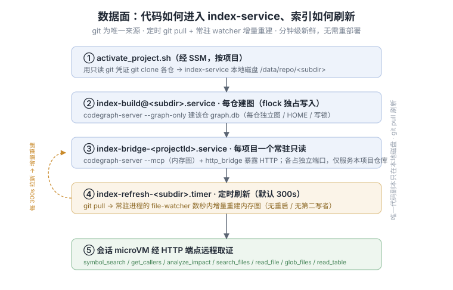
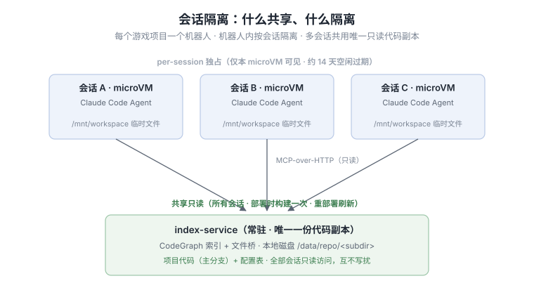

# 架构：写给 AI 的系统工作原理

先读本文，再改请求如何流转、代码在哪取证、CardKit 如何回传、会话如何隔离。面向人的文档（README、
structure）描述系统*是什么*；本文描述*一次提问如何在系统里流转*——改之前应先读懂的正是这部分。

下文代码指针用「组件 + 概念锚点」给出，请按名字 grep 定位，不要依赖行号（行号会随代码演进漂移）。

## 一次提问的生命周期

```
策划在飞书群 @机器人 提问
  → bot-gateway（TypeScript 长驻服务，bot-gateway/src/index.ts；**每个项目一个网关进程
      `bot-gateway@<projectId>`，各连自己的飞书 App**）
      · 通过长连接事件订阅消费 IM 事件（类比 lark-cli event consume）
      · 事件去重（飞书会重投；按 event_id 幂等）
      · 解析 @提及与问题文本，open_id → 内部 userId
      · 项目路由：本进程的 `PROJECT_ID` → 该项目的仓库集合 + 该项目 bridge 端口
        （src/project-routing.ts）；据此设定取证用的 `CODEGRAPH_MCP_URL` 指向本项目 bridge
      · 会话路由：(chat_id / thread_id) → runtimeSessionId（src/session-map.ts，DDB+TTL）
        —— 同一问答链复用同一个仍存活的 microVM；不同用户/会话绝不共用会话，否则上下文串扰
      · 先创建一张 CardKit 卡片（「正在思考…」），拿到 card_id 供后续流式更新
      · SigV4 签名调 AgentCore InvokeAgentRuntime（src/sigv4.ts），目标为**本项目专属的
        Runtime**（`source_truth_agent_<projectId>`），
        path = /runtimes/<encodeURIComponent(runtimeArn)>/invocations，带 runtimeSessionId
  → AgentCore Runtime（Firecracker microVM，每会话独立容器；每个项目一套独立 Runtime）
      · 秒级冷启；空闲达 idleRuntimeSessionTimeout（默认 900 秒 / 15 分钟，部署时显式配置）后回收；
        Session Storage 约 14 天过期。网关的 session 复用 TTL 与该 idle 值同源对齐（见下文「Runtime 调参」）
      · microVM 内运行 agent-container（Python，agent-container/agent.py）
          · @app.entrypoint 异步流式 handler（bedrock_agentcore.runtime.BedrockAgentCoreApp）
          · Claude Code Agent SDK（claude_agent_sdk.query / ClaudeAgentOptions），
            CLAUDE_CODE_USE_BEDROCK=1 走 Bedrock 计费
          · 取证只读通道（全部经 index-service 的 MCP-over-HTTP 接口；microVM 不挂任何文件系统）：
              · 术语表（旁路辅助，非前置步骤）：中文业务词（战力/爆率…）可经 codegraph_glossary_index /
                  codegraph_glossary_lookup 对应到英文代码符号，与 agent 自身想到的检索词**并用**——
                  不是「先查术语表再搜」的串行关卡（项目已知时才注册；辅助线索，结论仍须实际查看代码取证）
              (1) CodeGraph 定位 → 先查「哪个工程 / 哪些文件」（symbol_search / get_callers / analyze_impact）
              (2) 文件读取 → 按定位结果精准读取最新主分支源码与工程内配置表（Excel/JSON/CSV）：
                  codegraph_read_file / codegraph_glob_files / codegraph_search_files（仓库相对路径）
          · 每会话写入使用 Session Storage /mnt/workspace（microVM 级隔离的临时文件）
          · 逐步流式产出（AssistantMessage / ResultMessage）
  → bot-gateway 把流式输出更新到 CardKit 卡片（src/cardkit-client.ts；SSE 解析 src/parse-stream.ts）
      · 单一 markdown 组件适配所有格式；注意飞书卡片 update 有频控与 10 分钟更新窗口
      · 流式完成后按 AI 实际输出动态追加交互组件：多方案→选项按钮、数值→VChart 图表
        （低置信度时由 agent 在答案正文标注并建议转研发确认，非追加组件）
      · 结构化日志 + hashUserId 脱敏（src/log.ts，用户/会话标识不落明文，MVP 仅防滥用）
```

## 数据面：代码如何进入 index-service、索引如何更新

每个仓库的代码落到 index-service 本地，常驻 codegraph 的 file-watcher 增量重建内存图。来源分两种：
**git 仓**（默认）`git clone` 到本地、定时 `git pull` 保持最新主分支；**本地仓**（`source:"local"`，
推不到 git 远端时）由运维经 `scripts/push-local-repo.sh` 用 rsync 直推一份快照、手动刷新。下文先讲 git
仓的自动刷新链路，本地仓的手动链路见末尾「刷新方式（本地仓，手动）」。



**唯一一份代码、本地副本**：仓库只在 index-service 的**本地磁盘** `/data/repo/<subdir>`，由
`index-service/activate_project.sh` 用单一**只读 git 凭证**（Secrets Manager
`source-truth/git-credentials`，host 侧取出）`git clone` 各仓到本地；codegraph-server 索引该本地副本，
文件读取工具也读取该副本。**会话 microVM 不挂任何文件系统**——全部源码经 index-service 的 HTTP 接口读取，
没有共享挂载，故没有副本同步问题。

**刷新方式（git，自动）**：每个仓库一个 systemd timer `index-refresh-<subdir>.timer`（默认 300 秒，
可经 `projects.json` 的 `refreshIntervalSec` 配置）周期性 `git pull`；常驻 codegraph（`--mcp --graph-only`）
进程的 file-watcher 在数秒内对内存图做增量重建——无须重启、不会有两个进程同时写同一张 graph.db、无服务抖动。
主分支的改动因此分钟级内即反映到问答，无需重新部署。

**刷新方式（本地仓，手动）**：`source:"local"` 的仓没有 git 远端，因此**不挂 refresh timer**。运维在自己机器上跑
`scripts/push-local-repo.sh`，先把代码经网络 rsync 到主机的暂存目录 `/data/repo/<subdir>.incoming`（这一步较慢、
可能中断，但不碰 live 副本，bridge 照常服务）；传完后 `index-service/reindex_local_repo.sh` 再在主机本地把暂存目录
**原地 rsync 到 live 副本**——与 git 仓 `git pull` 用 `git reset --hard` 改写工作树是同一条路径：常驻 codegraph
进程的 file-watcher 几秒内对内存图增量重建，**不停 bridge、不全量重建、也不会有两个进程同时写同一张 graph.db**
（`.codegraph`/`.home` 图目录受 rsync protect 保护不被删）。本地 rsync 逐文件覆盖，期间 live 副本有数秒处于新旧文件混合的状态、查询可能读到尚未
一致的结果，watcher 随后即补齐——这与 git 仓原地 `git pull` 的行为一致（见
[`design/multi-repo-isolation_zh.md`](../design/multi-repo-isolation_zh.md) §8）。**例外是首次推送**：此时 live 副本
还没有 graph，watcher 无从增量，故先停 bridge、跑一次 `index-build@` 全量建图、再起 bridge（与 git 仓首次 activate
相同）。**术语表**也随推送增量刷新：脚本用本次同步的变更文件清单喂 `glossary_gen`（`--changed-list`/`--deleted-list`），
只重建变更文件的条目——与 git 仓按 `git diff` 增量是同一条路径，只是变更集来自 rsync 而非 git。本地仓是手动推送的
**快照**，更新时机由运维决定、可能滞后于真实主分支——重新推送后才更新。

**术语表（构建期引擎，离线）**：同一刷新链上，index 主机用本地 `claude` (cc) CLI 扫自有代码副本，产出
「中文词→英文符号」术语表（per-repo slice `/data/glossary/<项目>/<subdir>.jsonl`），供上面取证通道作旁路
线索用（非前置步骤）。这是对「不在 microVM 外跑引擎」的**明确例外**：构建期、无用户输入、无会话、不在请求路径上；cc 被锁定
（无写/执行/网络工具、不加载 repo 的 `.claude`），臆造中文别名由 grounding 校验丢弃。首建全量、刷新按
git diff 增量。完整工作原理、grounding 把关与价值边界见 `docs/agent/glossary.md`；边界约束见
`docs/agent/invariants.md` §6 与 AGENTS.md「构建期引擎」。

## 会话隔离模型（README 未展开）

| | 共享只读 | 每会话独占 |
|-|-|-|
| 内容 | 项目代码（主分支）+ CodeGraph 索引 | Agent 产生的临时文件 |
| 载体 | index-service 本地副本，经 HTTP 接口服务给所有会话 | AgentCore Session Storage `/mnt/workspace` |
| 可见性 | 所有会话 | 仅本 microVM |
| 生命周期 | 持久（git 仓定时 pull 刷新，分钟级反映；本地仓手动推送） | 每会话独占（约 14 天空闲过期） |



机器人粒度：**每个游戏项目一个机器人**，机器人内**按会话隔离**。上下文挂在飞书对话上、按需拉取消息
记录；多用户不可共用会话。

## 资源编排分工（改 Runtime 配置前必读）

基础设施**不全归 CDK**，且 MVP 阶段刻意先不 CDK 化：

- **MVP（当前）**：用 `agentcore` starter toolkit / boto3 直接配置 AgentCore Runtime + 创建 index-service，
  先跑通主流程、建立 POC 性能基准。CodeGraph 召回率、经 HTTP 接口读文件的延迟是主要待验证点——验证前不固化 IaC，
  避免返工。「为何必须建索引而非让 Agent 逐文件搜索」已有实测基准，见
  [`indexing-performance-spike.md`](indexing-performance-spike.md)（全仓冷扫描约 127s，建索引后定位查询恒 1–5ms）。
- **post-MVP（p2，渐进）**：CDK 管**稳定层**——会话容器镜像（DockerImageAsset，`Platform.LINUX_ARM64`）、
  AgentCore 执行 IAM 角色、index-service 常驻计算（含其本地仓库副本卷）、网关基础设施；
  而 **AgentCore Runtime 本身**（其 env、idle timeout、网络模式、请求头 allowlist）由 `scripts/deploy-all.sh`
  （已实现；内部 `lib/deploy_runtime.py`）用 boto3（`bedrock-agentcore-control` create/update_agent_runtime
  + endpoint）配——因为 Runtime 是快速演进的服务，CloudFormation 支持未稳定。

**含义**：要改 Runtime 的 env / idle timeout / 请求头，编辑 `scripts/lib/deploy_runtime.py` 并重跑
`deploy-all.sh`（`deploy.sh` 为已废弃转发垫片）——改 CDK 不生效。密钥（飞书 app secret、bot token）走
Secrets Manager / SSM，由 `install.sh` 交互式创建（`source-truth/feishu-<projectId>` 与全局
`source-truth/git-credentials`）；纯 `deploy-all.sh` 路径（CI）要求密钥已存在。重部署不覆盖真实凭证。

## Runtime 调参与成本权衡（idle / session 复用）

Runtime 按无状态使用：每次 invoke 都是一次全新的 SDK 会话，多轮追问由网关把历史问答重新拼进 prompt 续接
（external history replay，见 `bot-gateway/src/followup-context.ts`），不依赖 microVM 内残留的对话状态。
复用 `runtimeSessionId` 只为把同一问答链路由到同一个仍存活的 microVM、省去冷启动，本身不承载任何语义。

于是有一条硬性要求：**网关判定「会话可复用」的时间窗，不应超过 AgentCore 保留该 microVM 的时间窗。**
若网关的窗口更长，落在两者之间的追问会复用一个已被回收的会话 id，触发一次冷启动——功能不受影响（历史通过
replay 保留），但响应慢几秒。为此两个值由同一参数驱动：

- `idleRuntimeSessionTimeout`：microVM 空闲多久后回收。在 `deploy_runtime.py` 的 `lifecycleConfiguration`
  中设置，由 `deploy-all.sh --idle-timeout` 传入，默认 900 秒（15 分钟，与 AWS 默认一致）。
- 网关的 session 复用 TTL（`session-map.ts`）：部署时将上述值写入网关环境变量 `RUNTIME_IDLE_TIMEOUT_SECS`，
  TTL 据此派生，默认同为 15 分钟。调整时改动 `--idle-timeout` 一处即可，两侧随之联动。

**成本权衡。** AgentCore 的计费规则是：CPU 仅在活跃处理时计费（空闲时免费），内存则按整个 session 生命周期计费。
调大 idle 会延长 microVM 存活、增加这段空闲期的内存开销，只有该时间窗内确有追问发生时才划算。多数会话
在一次问答后即结束，调大 idle 主要覆盖「问答十余分钟后才追问」这类低频场景，收益通常不抵成本，所以默认
15 分钟。追问密集的场景（如客服式高频问答）才建议用 `--idle-timeout` 调大、接受相应的内存开销；要进一步
压缩成本则调小（最低 60 秒）。`maxLifetime`（默认 8 小时）是 microVM 的最长存活时间，到期强制重建，通常无需调整。

## 四个核心架构选择

source-truth 不同于「在容器外把 AI 当远程 MCP 客户端」的常见托管 MCP 形态——它把 AI 引擎放进 microVM
内，并围绕代码取证新增了两个有状态组件。四个核心选择：

1. **AI 在容器内运行**——会话 microVM 内直接运行 Claude Code Agent SDK（`agent-container/agent.py` 的
   agent 循环），AI 既是推理主体也是 MCP 消费端，而非外部 MCP 客户端。
2. **飞书 Bot 网关**——机器人身份 + 长连接事件流 + 会话→runtimeSessionId 映射。MVP 不引入每用户
   OAuth 体系；上下文挂在飞书对话上、按需拉取。**部署形态**：网关与 index-service **同主机**（每个项目一个
   systemd 实例 `bot-gateway@<projectId>.service`），由 deploy 的 gateway 阶段经 SSM 写
   `/etc/bot-gateway-<projectId>.env` + 启动；飞书凭证运行时从 Secrets Manager 取（不落盘）。注意飞书长连接是**全局单例**（同 app 只能一个
   client，否则争抢事件）——故蓝绿换 index 实例时，gateway 走 **break-before-make**（先停旧实例网关、确认长连接断开，
   再启动新实例网关），与 index/codegraph 的 make-before-break 相反。
3. **独立 CodeGraph 索引服务**——常驻服务，由唯一进程独占写 graph.db、stdio→streamable-HTTP 接口，对会话容器
   暴露只读**定位 + 读文件**查询；每个项目一个 bridge 进程 `index-bridge-<projectId>`（各占独立端口
   8080/8081/…，仅服务该项目的仓库，靠重复 `--workspace` 限定范围），其 file-watcher 对定时 git pull 的
   变更做增量重建（详见「数据面」）。
4. **代码仓只在 index-service 本地**——它在本地磁盘持唯一一份代码副本，由 `activate_project.sh` 用只读 git
   凭证 `git clone` 写入、systemd timer 定时 `git pull` 刷新，既供 codegraph 索引、又经 HTTP 接口的文件工具
   服务给会话容器；会话 microVM 不挂任何文件系统（无共享挂载）。

其余沿用通用运维惯例：ARM64 容器 + DockerImageAsset、CDK / boto3 分两层管 IaC、飞书 SDK / CardKit 生态、
空闲缩零按量计费、按游戏项目隔离机器人、结构化 JSON 日志 + hashUserId 脱敏、`deploy/ops/test` 三类脚本。

## 待验证技术点（POC 优先，影响架构定型）

- CodeGraph 对前端 Unity 风格 C# 与后端 Node.js（及 Lua 元表等动态模式）的索引召回率；
- 首次全量索引耗时（社区 13 万文件约 1 小时量级）；
- CodeGraph stdio→HTTP 转换（mcp-proxy 类）的稳定性、并发、路径对齐（工具返回仓库相对路径，如 `Assets/Scripts/Foo.cs`）；
- 经 HTTP 接口读文件的延迟（索引精准读取 vs 全仓文本检索兜底两条路径）；
- 飞书流式卡片频控、VChart 图表组件边界、动态组件回调路由。

细节见 `docs/design/architecture-overview_zh.md` 与 `requirements_zh.md`。
