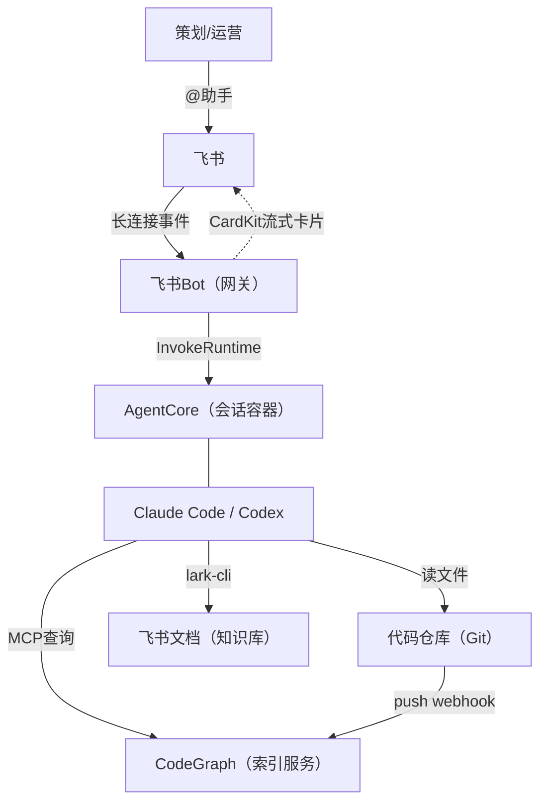
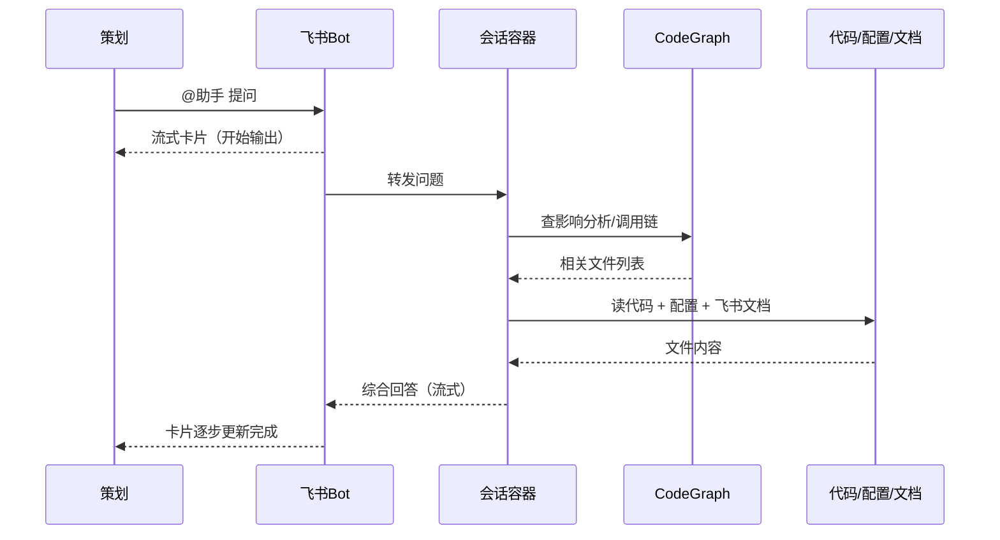
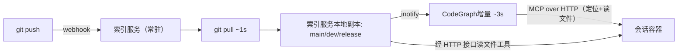

# 游戏研发智能助手 POC 方案

> 架构权威依据：POC 架构方案。MVP 边界与验收基准见 [`requirements_zh.md`](requirements_zh.md)；
> 面向 AI 的实现工作原理见 [`../agent/architecture.md`](../agent/architecture.md)。
>
> **本文按 2026-06-16 的 POC 方案原样存档，正文不再随实现更新；与现状不一致处一律以
> [`../agent/architecture.md`](../agent/architecture.md) 为准。** 主要偏离：
> - 代码刷新走 **systemd timer 定时 `git pull` + codegraph file-watcher 增量**，不用 push webhook / inotify；
> - MVP 是**单引擎 Claude Code**（Codex 后置），**仅主分支**（无 worktree 多分支）；代码来源以 git 仓为主，并支持本地仓（`source:"local"`，rsync 手动推送的快照，详见 [`../runbook_zh.md`](../runbook_zh.md)）；
> - 不读设计文档、不做数值模拟；完整审计护栏后置（MVP 安全仅保留 prompt/response 日志防滥用）；
> - §1.1「支持的场景」里的**数值模拟**与**配置/文案生成**是 POC 阶段的判断，**MVP 明确不做**（前者要跑引擎、后者要写回文件）——权威边界见 README 的「能力边界 / Scope」与 [`requirements_zh.md`](requirements_zh.md)；
> - 取证经 SDK 原生 HTTP MCP 连接，**无需 stdio→HTTP 转换层**（mcp-proxy）；代码只在索引服务本地磁盘，会话容器不挂任何文件系统。

策划日常有大量咨询性需求（理解代码逻辑、确认数值配置、评估修改影响），这些需求本身不复杂，却常常卡在研发
排期上。本方案在飞书中部署 AI 编程助手（Claude Code / Codex），让业务人员直接获得代码级别的问答和数值
模拟结果。

## 1. 使用形态

策划直接在飞书里提问，不需要等研发排期，也不需要理解代码，即可获得关联分析（响应时间取决于问题复杂度，简单
查询数秒、复杂分析数十秒）。

### 1.1 支持的场景

| 场景 | 典型问题 | 可行度 |
|-|-|-|
| 代码逻辑问答 | "消除判定逻辑在哪里""这个道具效果怎么实现的" | 可行 |
| 影响分析 | "改这个会影响哪些模块" | 可行 |
| 数值查询 | "50 级体力上限配了多少""这个掉率表的期望值" | 可行 |
| 数值模拟 | "如果通关奖励翻倍，经济系统几天会膨胀" | POC 判为可行，**MVP 不做（post-MVP）**——需要跑引擎/模拟数值，见上方免责声明与 README「能力边界」 |
| 配置/文案生成 | "按这个规则批量生成 50 关的配置表" | POC 判为可行，**MVP 不做（post-MVP）**——需要写回文件，与「只读问答」冲突 |
| 原型验证 | "写一版 4 连消的逻辑我看看效果" | 待探索 |

### 1.2 边界

- AI 产出供策划决策和研发参考，不自动上线、不接触线上系统
- 前期不做引擎内可玩 demo

## 2. 系统架构

核心链路：用户在飞书提问 → Bot 转给会话容器 → 容器内的 AI（Claude Code / Codex）通过 CodeGraph 定位
代码、读取配置、查阅飞书文档 → 结果流式返回飞书卡片。

下文「会话容器」均指 AgentCore Runtime 按会话启动的 Firecracker microVM。

### 2.1 完整请求流

### 2.2 关键设计决策

| 决策 | 选择 | 理由 |
|-|-|-|
| AI 引擎 | Claude Code + Codex 双引擎 | 共享同一套索引和知识层。默认使用 Claude Code；Codex 作为备选，按管理员配置或任务特征路由 |
| 运行环境 | AWS AgentCore Runtime | Firecracker microVM 隔离，托管扩缩容和生命周期，不自建 |
| 代码索引 | 独立索引服务（非容器内） | 索引服务常驻持有一份 clone，靠 systemd timer 定时 `git pull` + codegraph file-watcher 增量（主分支改动分钟级反映，见顶部偏离说明）；用户容器通过远程 MCP 查询，不占用用户侧资源 |
| 多分支 | git worktree | 共享对象库，每分支独立 worktree + 独立索引实例（CodeGraph 官方推荐的多分支模式），存储开销仅为工作区文件 |
| 配置表 | AI 直接读文件 | 配置在代码仓库内（Excel/JSON/CSV），不引入中间数据库 |
| 设计文档 | lark-cli 按需读取 | 容器内预装 lark-cli，需要时直接调用飞书 API 读文档，不预同步 |
| 飞书交互 | 基于官方 SDK 自研 | CardKit 流式卡片 + markdown 组件渲染 + 动态按钮 |

## 3. 关键点展开

### 3.1 CodeGraph：为什么需要、如何工作

大型代码库中，AI 仅靠 grep 逐文件搜索很难答好"改动会影响什么""从触发到生效经过哪些模块"这类结构性
问题。CodeGraph 预构建代码调用关系图（基于 Tree-sitter，支持 C#、C++、TypeScript、Python、Lua、Go、
Java、Kotlin、Swift、Ruby 等主流语言），AI 通过 `codegraph_impact`（影响分析）/ `codegraph_callers`
（调用链）/ `codegraph_search`（符号定位）等工具一次查询获取结果。

索引服务架构：

- 会话容器与索引服务不共享挂载：索引服务在本地磁盘持唯一一份代码副本、监听变更构建索引——一份代码，
  无副本同步问题；定位查询与文件读取都由索引服务经 HTTP 接口提供给会话容器
- AI 通过索引定位文件后，读取的是代码最新版本（非索引快照）
- 刷新靠 systemd timer 定时 `git pull` + file-watcher 增量（HEAD 未变即跳过），无夜间全量重建兜底

### 3.2 飞书交互：流式卡片 + 动态组件

AI 输出格式不固定（有时纯文字、有时带代码块、有时有表格）。设计上用一个 markdown 组件适配所有格式，
平台自动渲染。流式完成后按 AI 实际输出内容动态追加交互组件（按钮/图表/下拉）：

- AI 给出多个方案 → 自动生成选项按钮，用户点选后继续对话
- AI 输出数值结果 → 追加图表组件可视化
- 回答置信度低 → AI 在答案正文标注低置信度并建议转研发确认（MVP 为文字建议，非一键转人工按钮）

对话采用飞书话题模式，同一问答链在话题内展开，避免频繁打扰群聊。

### 3.3 隔离：什么共享、什么隔离

- **共享只读**：项目代码（各分支 worktree）、索引——所有会话看同一组，不可写
- **每会话独占**：Agent 产生的临时文件——microVM 级隔离，用户间互不可见

**为什么这么设计**：代码和索引是项目级资源，所有人查询的是同一个项目，复制 N 份既浪费存储，又会造成更新
不同步。对话和临时文件是个人工作状态，必须隔离。落地方式：共享代码与索引放在索引服务本地磁盘，经其
MCP-over-HTTP 接口（定位 + 读文件工具）提供给所有会话容器，会话容器本身不挂任何文件系统。每会话独占的临时
文件则用 AgentCore Session Storage（`/mnt/workspace`，按会话自动分配独占空间），无需额外开发。

|  | 共享存储 | 会话存储 |
|-|-|-|
| 内容 | 代码、索引、配置表 | Agent 产生的临时文件 |
| 数量 | 一组分支 worktree（全员共用） | 每个 Agent 一份 |
| 权限 | 只读 | 可读写 |
| 可见性 | 所有 Agent | 仅本 Agent |
| 生命周期 | 持久（定时 `git pull` 分钟级 + file-watcher 增量） | 每会话独占（14 天空闲过期） |

### 3.4 文档与代码冲突

设计文档和代码实现可能不一致。处理原则：

- **代码为准**：矛盾时 AI 以代码实际实现为真实依据
- **标注差异**：回答中明确指出"设计文档描述为 X，代码实现为 Y，以代码为准"
- **标注时间**：引用文档时注明最后修改时间

## 4. 安全

- **隔离**：Firecracker microVM 按会话隔离，进程内存会话结束擦除；Session Storage 按会话隔离、最长 14 天回收
- **审计**：全量 prompt/response 记录（谁/何时/问什么/答什么）
- **设计文档权限**：机器人作为文件夹只读协作者，未授权文档不可见

## 5. 待验证技术点

**索引与存储**

| 验证项 | 关注点 | 关联 |
|-|-|-|
| CodeGraph 对动态语言特性的索引召回 | 用代表性开源仓库测试调用图召回率：C# 的事件/委托/partial、引擎消息函数、Lua 元表继承等动态模式属静态分析盲区，实际召回可能显著低于官方基准 | §3.1 |
| push→索引可用端到端时延 | webhook → git pull → 增量索引完成的端到端耗时，在代表性仓库规模上实测；同时实测首次全量索引耗时（社区在 13 万文件仓库上约 1 小时量级） | §3.1 |
| MCP stdio→HTTP 转换 | CodeGraph 原生仅支持 stdio 通信；索引服务侧需加一层 stdio 转 streamable HTTP 的代理（mcp-proxy 类组件），验证转换稳定性、并发能力，及工具返回的文件路径与容器挂载路径的对齐 | §3.1 |
| 本地副本增量索引 | 索引服务在本地磁盘持唯一一份代码副本；定时 `git pull` 后 codegraph file-watcher 数秒内增量重建内存图——已落地验证 | §3.1 / §3.3 |
| 经 HTTP 接口读文件性能 | 会话容器经索引服务 MCP-over-HTTP 接口读文件：在代表性仓库规模上实测「索引定位 + 精准读取」主路径与全仓文本检索兜底两种模式的实际延迟，确认是否需要优化 | §3.1 / §3.3 |
| 多分支 worktree + 多索引实例 | 每分支独立 worktree + 常驻 CodeGraph 实例的资源占用；分支增删时索引实例的生命周期管理 | §2.2 / §3.1 |

**飞书交互**

| 验证项 | 关注点 | 关联 |
|-|-|-|
| 流式卡片更新频控 | 飞书对卡片 update 有频率限制，需验证逐字流式更新的实际流畅度与 10 分钟更新窗口边界 | §3.2 |
| 图表组件可表达边界 | CardKit 图表组件（VChart）验证实际 spec，确认临界线标注、动态数据绑定等具体能力边界 | §3.2 |
| 动态组件追加 | 按 AI 自由输出动态决定按钮数量与回调，需要卡片模板 + 回调路由设计并验证原型 | §3.2 |

## 附录：技术依赖

| 依赖 | 状态 | 备注 |
|-|-|-|
| AgentCore Runtime | GA | Firecracker 隔离，VPC 模式（经 HTTP 访问索引服务；不挂任何文件系统） |
| AgentCore Session Storage | Preview | 会话级独占存储，14 天空闲过期；Preview 阶段，正式商用前需复核可用性 |
| Claude Code Agent SDK | GA | 官方容器化方案 |
| Codex CLI | GA | headless 模式 |
| CodeGraph | 开源 | MCP server（stdio），经索引服务侧代理转成 HTTP 提供；文件监听增量 |
| lark-cli | GA | 飞书文档读取 |
| 飞书 CardKit 流式卡片 | GA | 客户端 7.20+ |
| 飞书 CardKit 图表组件 | GA | VChart 规范，支持柱状/折线/饼图等，依赖较新客户端版本 |
