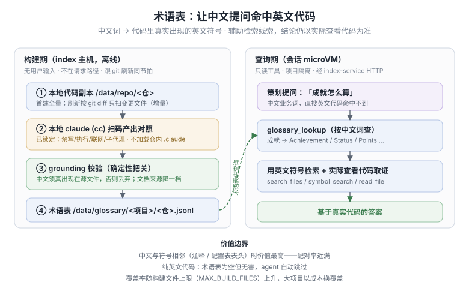
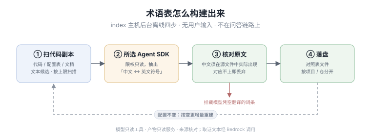
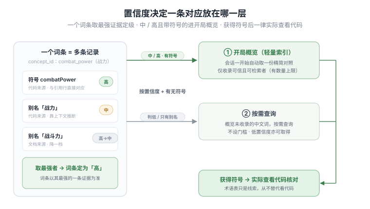

# 术语表是怎么来的

策划用中文问「公会战怎么结算」「招募保底多少抽」，可代码里写的是英文——公会战可能是历史代号
`LeagueWar`，保底藏在 `pity_counter` 这类内部叫法里。直接拿中文去搜代码，常常只搜到注释，甚至
一无所获。**术语表**就是为了补上这一环：把中文业务词对应到代码里真实出现的英文符号，让助手知道
「这个中文，该去搜哪个英文词」。

它只是**额外的检索线索，不是答案**——结论永远以实际查看代码为准。本文讲它怎么从代码里生出来、
长什么样、凭什么可信。想知道助手查询时怎么用它，见面向 AI 的 [`agent/glossary.md`](agent/glossary.md)。



## 怎么构建出来的

术语表在 **index 主机后台离线生成**，不在用户提问的处理链路上——它处理的是「已经存在机器上的代码
副本」，没有用户输入、没有会话。整个过程分四步：



1. **扫代码副本**：首次全量扫一遍，之后只扫 `git pull` 带来的变更文件（增量），跟代码刷新同步进行。
   扫描**不限文件类型**——代码、配置表、README、设计文档都看，因为中文术语常常写在文档和注释里。
2. **让本地 Claude 读代码、提对照**：在主机上跑一个被严格限权的 Claude（只能读、不能写不能联网），
   让它从代码里抽出「中文词 ↔ 英文符号」的对应关系。
3. **核对原文**（关键一步）：抽出来的中文词，必须**真实出现在它声称的那个源文件里**才保留，否则丢弃。
   这一步专门拦截 Claude 无根据推断或自行生成的词——见下文「凭什么可信」。
4. **落盘**：写成对照表文件，按项目、按仓库分开存放。

> 这是项目里「不跑引擎」原则的一个有意例外：它是**构建期**的离线工具，不是按用户提问实时回答的引擎，
> 所以可以在主机本地跑。约束也很硬：读代码的 Claude 被限权、产物只供只读服务、代码全程不出这台机器。

## 产物长什么样

每个仓库生成一个对照表文件，路径形如：

```
/data/glossary/<项目>/<仓库>.jsonl
```

文件是 JSONL 格式——一行一条记录。一个「词条」指同一件业务事项的英文符号加上它的各种中文叫法，
每条记录把这个词条的一种说法记下来，字段如下：

| 字段 | 含义 |
|------|------|
| 词条 ID | 同一词条的归并键，比如「战力」的各种说法都挂在 `combat_power` 下 |
| 类型 | `符号`（代码里的英文标识符，助手会拿它当搜索词）或 `别名`（中文说法，只用来对应、不直接搜） |
| 内容 | 具体的英文符号名，或中文词 |
| 来源 | 这条记录是从哪个文件、哪一行抽出来的（用于回溯取证） |
| 置信度 | 高 / 中 / 低三档，决定它排得多靠前、是否进入轻量索引 |

一个词条通常有多条记录：一条记英文符号、几条记它的中文说法。例如「战力」这个词条，可能同时记下
英文符号 `combatPower`、中文别名「战力」和「战斗力」，全部指向同一处代码。落到文件里大致长这样：

```jsonl
{"concept_id":"combat_power","kind":"symbol","value":"combatPower","source":"src/Player.cpp","line":214,"confidence":"high"}
{"concept_id":"combat_power","kind":"alias","value":"战力","source":"src/Player.cpp","line":214,"confidence":"high"}
{"concept_id":"combat_power","kind":"alias","value":"战斗力","source":"docs/数值设计.md","line":12,"confidence":"med"}
```

助手看到中文「战力」，就知道去代码里搜 `combatPower`——这一步靠它自己多半搜不到，因为中文和英文对不上。

## 凭什么可信

术语表是让 Claude 读代码生成的，怎么保证它不臆造？两项机制：

- **中文必须能在代码里找到**：每个中文词都要在它声称的源文件里真实出现，对应不上就直接丢弃。
  这一关挡住了 Claude 的无根据推测——它必须照搬代码和注释里实际出现的词，不能自行翻译。
  举个例子：源文件里写着 `// 招募保底计数 pity_counter`，那「招募保底」会被留下、对应到
  `pity_counter`；但如果 Claude 看到纯英文的 `GuildBattleSettle`，自行配上「公会战结算」，
  而这几个中文字在文件里根本没出现，这条就会被丢弃。
- **代码比文档更可信**：文档（README、设计案）里的术语也会收，但**置信度降一档**。
  同一词条下，来自代码的说法永远排在来自文档的前面；文档来源的词不会进入显眼的索引，只在按需查询时才取出。
  这呼应项目的核心原则——代码与文档冲突时，以代码为准。

那上面说的「置信度」（前面产物表里的高 / 中 / 低）又是怎么定的？分三步：

1. **先由 Claude 按证据强弱判**：抽词时它要给每条记录标一档——中文词或符号就明明白白写在引用那一行上，
   记**高**；靠上下文推断出来的，记**中**；更弱的记**低**。
2. **代码兜底**：Claude 标了非法值就压成「低」（最不可信），漏标则按「高」处理——宁可让人核也不静悄悄丢。
3. **文档来源再降一档**：就是上一条说的，文档里抽的词比代码里的低一级。

几个例子帮助理解三档：

- **高**——`int combatPower;` 行尾的注释就是「// 战力」，中文和符号贴在一起、明摆着对应。
- **中**——某个配置表表头叫「负重上限」，几行外的代码字段是 `maxEncumbrance`，看得出是一回事，
  但不在同一行，靠上下文推断。
- **低**——一段设计文档里提到「疲劳值」，但当前这个仓库里没找到对得上的字段，对应关系很弱。

档位决定它排得多靠前、以及要不要进会话开始时的轻量索引：**中及以上**进索引（中文别名常被判为「中」，
正是术语表最有用的部分，所以门槛不卡在「高」）；判「低」的不进索引，只在按需精确查询时才取出。

正因如此，术语表给出的对应**仅供参考、可能不准**，最终结论一定要实际打开代码确认。它的作用是
「帮助手少走弯路」，不是「替助手下结论」。

## 助手怎么用它

术语表对助手是「两层」的，对应「开局先给一份概览、需要时再细查」——置信度决定一条对应放在哪层。



- **开局给一份概览（轻量索引）**：开局时助手按需调用一次工具、取一份精简对照表当线索（是它主动查，不是系统自动塞进去）。能进这份概览的有门槛——
  置信度要**中或高**，而且这个词条**至少得有一个英文符号**（只有中文说法、没有可搜的英文词，放概览里没用）。
  词条还有数量上限，所以这层是「把最可信、最有用的露出来」。
- **需要时再细查（按需查询）**：概览里没有的中文词，助手可以拿这个词当场去查——**这层不设门槛，
  判「低」的也取得到**。所以「低」不是被丢掉，只是不主动塞进概览，要用时仍查得到。

不管从哪层拿到英文符号，助手都**照常实际打开代码确认**，再给结论——术语表只决定「先看哪些线索」，
从不替代看代码这一步。

## 成本与运维

- **后台异步，不挡问答**：部署完成后问答立即可用。大仓首次全量构建可能要几十分钟，**这段时间问答正常**，
  只是部分中文词的对应关系还在生成中。构建完成后自动生效。
- **首次全量是一次性成本，之后只增量**：实测在一个约 1.4 万文件的大型中文游戏框架上，全量抽出
  4881 条记录 / 2634 个词条，一次性成本约 \$372；之后只扫变更文件，日常成本远低于此。
- **失败也不影响问答**：若构建失败（比如本地 Claude 没装上、调不通模型），术语表只是暂时为空，
  助手会自动退回常规检索，问答照常进行。
- **纯英文 / 无中文项目**：术语表自然为空、零开销，助手自动跳过。

构建进度、上限设置、失败排查的具体操作，见 [`runbook.md`](runbook.md)（搜「术语表」）。
实测数据与价值边界的更多细节，见 [`agent/glossary.md`](agent/glossary.md)。
